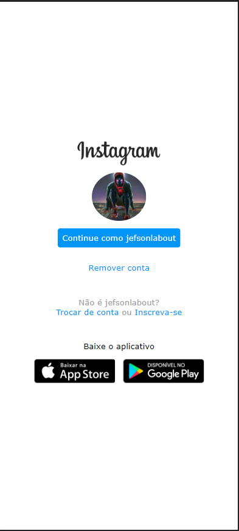

<h1 align="center">Recriando a página inicial do Instagram - DIO</h1>

  

  

  
  
  
    
   
   
 

<h1 align="center">
    
</h1>

<h4 align="center"> 
	🚀 Instagram 🚀 Concluído 🚀 
</h4>

 <a href="#-sobre-o-projeto">Sobre</a> •
 <a href="#-funcionalidades">Funcionalidades</a> •
 <a href="#-layout">Layout</a> • 
 <a href="#-como-executar-o-projeto">Como executar</a> • 
 <a href="#-tecnologias">Tecnologias</a> • 
 <a href="#-contribuidores">Contribuidores</a> • 
 <a href="#-autor">Autor</a> • 
 <a href="#user-content--licença">Licença</a>

## 💻 Sobre o projeto

Nesse projeto foi lançado o desafio de reconstruir a página de login do Instagram.
Foi utilizado CSS com Flexbox, onde foi trabalhado o posicionamento dos elementos e a  responsividade

Projeto desenvolvido durante a Santander Bootcamp Fullstack Developer

---

## 🎨 Layout

### Mobile

  

### Web

   

---

# Clone este repositório
$ git clone git@github.com:Jeferson-Labout/instagram.git

## 🛠 Tecnologias

As seguintes ferramentas foram usadas na construção do projeto:

#### **Website**  ([React](https://reactjs.org/)  +  [TypeScript](https://www.typescriptlang.org/))

-   **[React Router Dom](https://github.com/ReactTraining/react-router/tree/master/packages/react-router-dom)**
-   **[React Icons](https://react-icons.github.io/react-icons/)**
-   **[Axios](https://github.com/axios/axios)**
-   **[Leaflet](https://react-leaflet.js.org/en/)**
-   **[React Leaflet](https://react-leaflet.js.org/)**
-   **[React Dropzone](https://github.com/react-dropzone/react-dropzone)**

> Veja o arquivo  [package.json](https://github.com/Jeferson-Labout/README-ecoleta/blob/master/web/package.json)

#### **Server**  ([NodeJS](https://nodejs.org/en/)  +  [TypeScript](https://www.typescriptlang.org/))

-   **[Express](https://expressjs.com/)**
-   **[CORS](https://expressjs.com/en/resources/middleware/cors.html)**
-   **[KnexJS](http://knexjs.org/)**
-   **[SQLite](https://github.com/mapbox/node-sqlite3)**
-   **[ts-node](https://github.com/TypeStrong/ts-node)**
-   **[dotENV](https://github.com/motdotla/dotenv)**
-   **[Multer](https://github.com/expressjs/multer)**
-   **[Celebrate](https://github.com/arb/celebrate)**
-   **[Joi](https://github.com/hapijs/joi)**

> Veja o arquivo  [package.json](https://github.com/Jeferson-Labout/README-ecoleta/blob/master/server/package.json)

#### **Mobile**  ([React Native](http://www.reactnative.com/)  +  [TypeScript](https://www.typescriptlang.org/))

-   **[Expo](https://expo.io/)**
-   **[Expo Google Fonts](https://github.com/expo/google-fonts)**
-   **[React Navigation](https://reactnavigation.org/)**
-   **[React Native Maps](https://github.com/react-native-community/react-native-maps)**
-   **[Expo Constants](https://docs.expo.io/versions/latest/sdk/constants/)**
-   **[React Native SVG](https://github.com/react-native-community/react-native-svg)**
-   **[Axios](https://github.com/axios/axios)**
-   **[Expo Location](https://docs.expo.io/versions/latest/sdk/location/)**
-   **[Expo Mail Composer](https://docs.expo.io/versions/latest/sdk/mail-composer/)**

> Veja o arquivo  [package.json](https://github.com/Jeferson-Labout/README-ecoleta/blob/master/mobile/package.json)

#### **Utilitários**

-   Protótipo:  **[Figma](https://www.figma.com/)**  →  **[Protótipo (Ecoleta)](https://www.figma.com/file/1SxgOMojOB2zYT0Mdk28lB/Ecoleta)**
-   API:  **[IBGE API](https://servicodados.ibge.gov.br/api/docs/localidades?versao=1)**  →  **[API de UFs](https://servicodados.ibge.gov.br/api/docs/localidades?versao=1#api-UFs-estadosGet)**,  **[API de Municípios](https://servicodados.ibge.gov.br/api/docs/localidades?versao=1#api-Municipios-estadosUFMunicipiosGet)**
-   Maps:  **[Leaflet](https://react-leaflet.js.org/en/)**
-   Editor:  **[Visual Studio Code](https://code.visualstudio.com/)**  → Extensions:  **[SQLite](https://marketplace.visualstudio.com/items?itemName=alexcvzz.vscode-sqlite)**
-   Markdown:  **[StackEdit](https://stackedit.io/)**,  **[Markdown Emoji](https://gist.github.com/rxaviers/7360908)**
-   Commit Conventional:  **[Commitlint](https://github.com/conventional-changelog/commitlint)**
-   Teste de API:  **[Insomnia](https://insomnia.rest/)**
-   Ícones:  **[Feather Icons](https://feathericons.com/)**,  **[Font Awesome](https://fontawesome.com/)**
-   Fontes:  **[Ubuntu](https://fonts.google.com/specimen/Ubuntu)**,  **[Roboto](https://fonts.google.com/specimen/Roboto)**

---

## 📝 Licença

Este projeto esta sobe a licença [MIT](./LICENSE).

Feito com ❤️ por Jeferson Labout 👋🏽 [Entre em contato!](https://www.linkedin.com/in/jeferson-labout/)

---

##  Versões do README

[Português 🇧🇷](./README.md)  |  [Inglês sem emojis 🇺🇸](./README-en.md) | [Portugues sem logo  🇧🇷](./README-sem-logo.md) 
