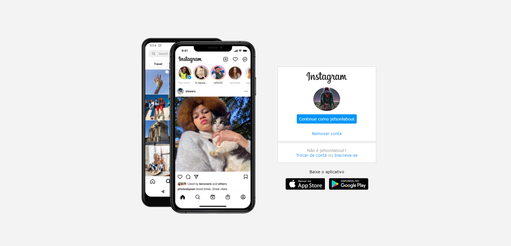
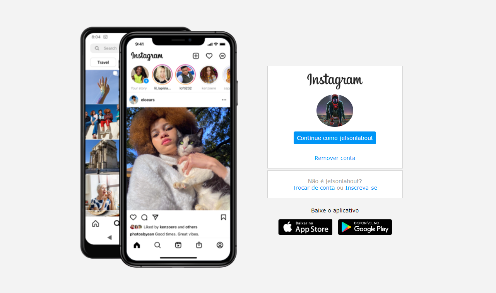

<h1 align="center">Recriando a página inicial do Instagram - DIO</h1>

  

  

  
  
  
    
   
   
 

<h1 align="center">
	  
    
   
</h1>

<h4 align="center"> 
	🚀 Instagram 🚀 Concluído 🚀 
</h4>

 <a href="#-sobre-o-projeto">Sobre</a> •
 <a href="#-layout">Layout</a> • 
 <a href="#user-content--licença">Licença</a>

## 💻 Sobre o projeto

Nesse projeto foi lançado o desafio de reconstruir a página de login do Instagram.
Foi utilizado CSS com Flexbox, onde foi trabalhado o posicionamento dos elementos e a  responsividade

Projeto desenvolvido durante a Santander Bootcamp Fullstack Developer

---

## 🎨 Layout

### Mobile

  

### Web

   

---

# Clone este repositório
$ git clone https://github.com/Jeferson-Labout/instagram.git

## 📝 Licença

Este projeto esta sobe a licença [MIT](./LICENSE).

Feito com ❤️ por Jeferson Labout 👋🏽 [Entre em contato!](https://www.linkedin.com/in/jeferson-labout/)

---

